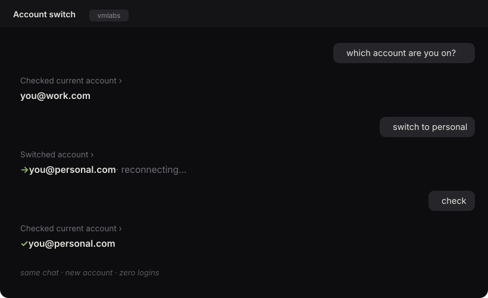
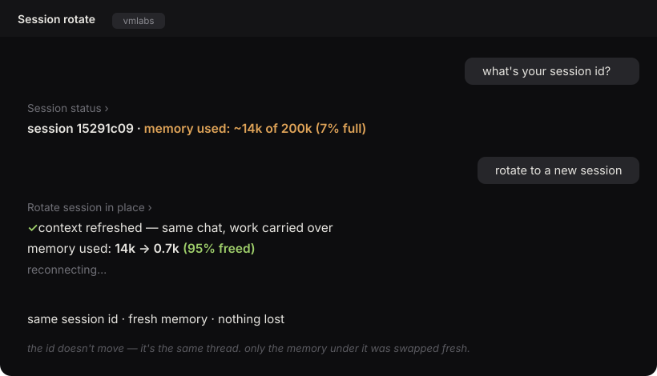

# bot-harness 🪑

**one thread. many accounts. never a break.**

Keep your Claude Code session alive when an account runs out of room on the
model you use — by switching to another account *you own* and resuming the
**same conversation**. No new chat, no re-login. Works with **any Claude model**.


## How it works


A Claude Code session's account is fixed the instant its process starts — the
desktop app injects its token before any shell runs, so nothing on your machine
can choose it. But the conversation is a local, **account-agnostic transcript**:
`claude --resume <id>` under another account continues the same thread. So
bot-harness picks a healthy account from your pool and re-opens your thread on it.

## See it

**Switch accounts mid-chat** — same thread, new account, zero logins:



**Rotate the session** — same chat, fresh memory, work carried over:



## Install

```bash
git clone https://github.com/ryukdev/bot-harness ~/.bot-harness-src
ln -sf ~/.bot-harness-src/bin/bot-harness /usr/local/bin/bot-harness
bot-harness doctor
```

No build, no dependencies — plain node (18+) and the `claude` CLI.

Or paste this into Claude Code and let it set itself up:

```text
Clone https://github.com/ryukdev/bot-harness into ~/.bot-harness-src, read
install.md, install it so `bot-harness` is on my PATH, register it as a skill
named bot-harness using SKILL.md, then walk me through onboarding.
```

## Use

```bash
bot-harness config model opus            # the model whose limit you actually hit (any Claude model)
bot-harness token add you@work.com  sk-… # add each account you own (paste the token)
bot-harness token list                   # your emails + who has headroom right now
bot-harness status                       # which account THIS session is paying
bot-harness switch bunny@you.com         # move THIS chat to another account (auto-reconnects)
bot-harness session status               # session id + how full its memory is
bot-harness session rotate --in-place    # same chat, fresh memory — work carried over (auto-reconnects)
bot-harness app on                       # desktop-app sessions pick a healthy seat on reconnect
```

Both `switch` and `rotate --in-place` reconnect the app **automatically** (a tiny
launchd watcher drops the connection after your reply renders — usually zero
clicks, at most one retry tap).

Your tokens live only in `~/.bot-harness/accounts.json` (chmod 600) — never
printed, never committed, never sent anywhere. bot-harness stores and routes; it
never acquires or transmits credentials.

## Architecture


- **Core** (standalone): your account pool → the prober asks each account whether
  it has headroom on your model → the router picks a healthy one → `seat` resumes
  the thread there. `app on` shims the desktop app so its sessions pick a healthy
  seat on reconnect; `app off` restores.
- **Addon** (optional): serve your outputs on your own tailnet — a link that opens
  with no login. Absent, it falls back to a local file. Never required.
- **The honest limit:** switches happen at process birth — one reconnect per swap,
  and the Claude **mobile** app just disconnects. That's physics of processes.

## What it does NOT do yet — and where sharingu takes over

bot-harness is honest about its edges. Every one is a process limit, and every
one is exactly what a database-backed thread fixes.

| today, with bot-harness | tomorrow, with sharingu |
|---|---|
| one **reconnect** per swap (not zero-click) | seats rotate **while you type**, announced |
| **no mobile** — the Claude mobile app drops on a switch | any **phone browser**, no reconnect |
| **artifacts** need your own tailnet (an addon) | **native** output serving, built in |
| switches **accounts** only | **smart routing across N models, LLMs & harnesses** |
| **session rotation** is coming (v0.2) | sessions refresh **mid-thread**, backed by a real spine |

Same idea, two depths: bot-harness keeps your thread alive across accounts on
your machine; **sharingu** makes seats, sessions, models and harnesses all
swap seamlessly underneath one thread — because the thread lives in a database,
not a process.

## The upgrade → sharingu

bot-harness keeps a *session* alive. **sharingu changes what a session is.**

A session is temporary — it starts, fills up, ends. A sharingu thread lives in a
database, so it never has to: accounts, sessions, and models rotate underneath it
while it keeps going — any device, any browser, no reconnect. And a thread that
outlives its session is no longer just a chat. It can be promoted into a named
**agent** with standing config, running on a long horizon instead of a single sitting.

That's the one simplification everything else falls out of: **continuous threads
for everything** — a conversation, a build, a dashboard, an automation, an agent,
all the same primitive: *a thread that never has to end.*

bot-harness is the wedge. **sharingu is where a session becomes a living thread.**

---

MIT · built by [ryukdev](https://github.com/ryukdev)
