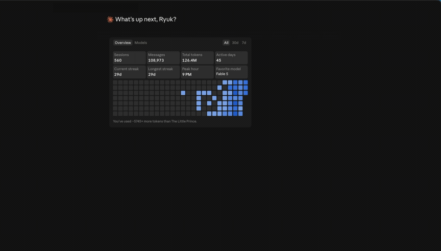

# bot-harness 🪑

**One thread. Many accounts. Never a break.**

Keep a Claude Code session alive when one account runs out of room — by switching
to another account *you own* and resuming the **same conversation**. No new chat,
no re-login. Works with any Claude model.



## Install

```bash
git clone https://github.com/ryukdev/bot-harness ~/.bot-harness-src
ln -sf ~/.bot-harness-src/bin/bot-harness /usr/local/bin/bot-harness
bot-harness doctor
```

No build, no dependencies — plain node (18+) and the `claude` CLI. Full setup,
including the desktop-app switcher, is in [install.md](install.md).

Or paste this into Claude Code and let it install itself:

```text
Clone https://github.com/ryukdev/bot-harness into ~/.bot-harness-src, read
install.md, put `bot-harness` on my PATH, register it as a skill from SKILL.md,
then walk me through onboarding.
```

## Use

```bash
bot-harness config model opus            # the model whose limit you hit (any Claude model)
bot-harness token add you@work.com  sk-… # add each account you own (paste the token)
bot-harness token list                   # your emails + who has headroom right now
bot-harness status                       # which account THIS session is paying
bot-harness switch you@personal.com      # move THIS chat to another account (auto-reconnects)
bot-harness session status               # session id + how full its memory is
bot-harness session rotate --in-place    # same chat, fresh memory — work carried over
```

Both `switch` and `rotate --in-place` reconnect the app **automatically** — a tiny
launchd watcher drops the connection after your reply renders, so it's usually
zero clicks (at most one retry tap).

## How it works

A Claude Code session's account is fixed the instant its process starts — the
desktop app injects its token before any shell runs, so nothing on your machine
can pick it afterward. But the conversation is a local, **account-agnostic
transcript**: `claude --resume <id>` under another account continues the same
thread. bot-harness picks a healthy account from your pool and re-opens your
thread on it.

Your tokens live only in `~/.bot-harness/accounts.json` (chmod 600) — never
printed, never committed, never sent anywhere. bot-harness stores and routes; it
never acquires or transmits credentials. See [SECURITY.md](SECURITY.md).

## The honest limits — and where [sharingu](https://github.com/ryukdev) takes over

Every limit below is a property of *processes*, and every one is what a
database-backed thread removes.

| today, with bot-harness | tomorrow, with sharingu |
|---|---|
| one **reconnect** per swap | seats rotate **while you type** |
| **no mobile** — the Claude app drops on a switch | any **phone browser**, no reconnect |
| switches **accounts** only | smart routing across **N models & harnesses** |

bot-harness keeps a *session* alive. sharingu changes what a session **is**: a
thread that lives in a database instead of a process — so accounts, sessions and
models rotate underneath it while it keeps going, and a thread that outlives its
session can be promoted into a standing **agent**. One primitive, **continuous
threads for everything.** bot-harness is the wedge; sharingu is where a session
becomes a living thread.

## Contributing

Issues and PRs welcome — see [CONTRIBUTING.md](CONTRIBUTING.md). Found a security
issue? [SECURITY.md](SECURITY.md) has the private path.

---

MIT © [ryukdev](https://github.com/ryukdev)
